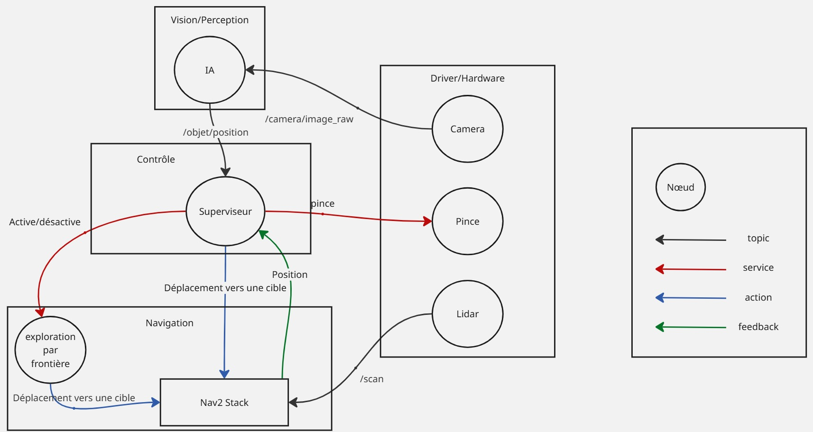

# Projet TB3 Exploration & IA

Ce projet permet à un robot TurtleBot3 (Waffle) d'explorer une pièce inconnue de manière autonome (SLAM + Explore Lite) tout en analysant les objets rencontrés via une caméra simulée et un script de détection IA avec en plus la possibilité de ramasser des objets. 

## archi WIP 



## Prérequis Système

* **OS :** Ubuntu 22.04 LTS (Jammy Jellyfish)
* **Simulateur :** Gazebo Classic 11
* **ROS Version :** ROS 2 Humble Hawksbill

---

* ## Installation

### 1. Installer ROS 2 Humble
Si ROS 2 n'est pas encore installé, ouvrez un terminal et exécutez :

```bash
sudo apt update && sudo apt install software-properties-common curl -y
sudo add-apt-repository universe
sudo curl -sSL [https://raw.githubusercontent.com/ros/rosdistro/master/ros.key](https://raw.githubusercontent.com/ros/rosdistro/master/ros.key) -o /usr/share/keyrings/ros-archive-keyring.gpg
echo "deb [arch=$(dpkg --print-architecture) signed-by=/usr/share/keyrings/ros-archive-keyring.gpg] [http://packages.ros.org/ros2/ubuntu](http://packages.ros.org/ros2/ubuntu) $(. /etc/os-release && echo $UBUNTU_CODENAME) main" | sudo tee /etc/apt/sources.list.d/ros2.list > /dev/null
sudo apt update
sudo apt install ros-humble-desktop -y
sudo apt install python3-colcon-common-extensions -y
```

### 2. Installer les paquets du projet
```bash
sudo apt update
sudo apt install ros-humble-navigation2 ros-humble-nav2-bringup ros-humble-slam-toolbox -y
sudo apt install ros-humble-turtlebot3* -y
sudo apt install ros-humble-explore-lite -y
sudo apt install python3-pip python3-opencv ros-humble-cv-bridge ros-humble-vision-opencv -y
```

### 3. Configuration de l'environnement
```bash
echo 'source /opt/ros/humble/setup.bash' >> ~/.bashrc
echo 'export TURTLEBOT3_MODEL=waffle' >> ~/.bashrc
echo 'export LDS_MODEL=LDS-01' >> ~/.bashrc
# Fix pour l'affichage 3D dans les Machines Virtuelles
echo 'export LIBGL_ALWAYS_SOFTWARE=1' >> ~/.bashrc
# Rechargez le terminal
source ~/.bashrc
```
### 4. Clonage et Compilation
```bash
# Création du workspace
mkdir -p ~/ros2_ws/src
cd ~/ros2_ws/src

# Cloner le projet
git clone [https://github.com/NoeFBou/exploration_and_research_turtlebot.git](https://github.com/NoeFBou/exploration_and_research_turtlebot.git)

cd ~/ros2_ws
rosdep install --from-paths src --ignore-src -r -y

# Compiler
colcon build --symlink-install
source install/setup.bash
```

## Lancement

1er terminal pour lancer l'exploration automatique
```bash
cd ~/ros2_ws
source install/setup.bash
ros2 launch tb3_autonomy auto_explore.launch.py
```

2eme terminal pour activer la caméra pour l'ia
```bash
cd ~/ros2_ws
source install/setup.bash
ros2 run tb3_autonomy camera_ai
```

## Dépannage

Robot invisible
```bash
echo 'export GAZEBO_MODEL_PATH=$GAZEBO_MODEL_PATH:/opt/ros/humble/share/turtlebot3_gazebo/models' >> ~/.bashrc
source ~/.bashrc
```


