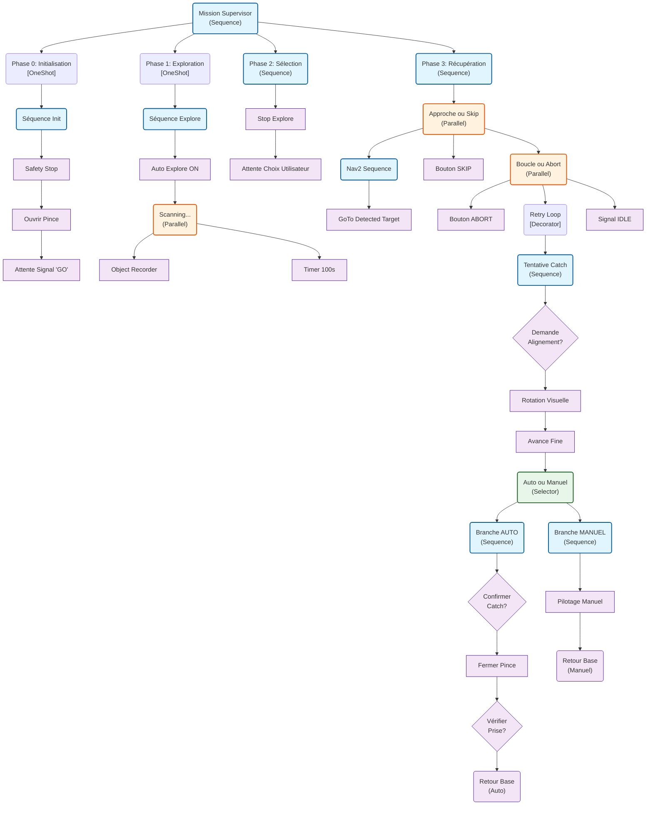
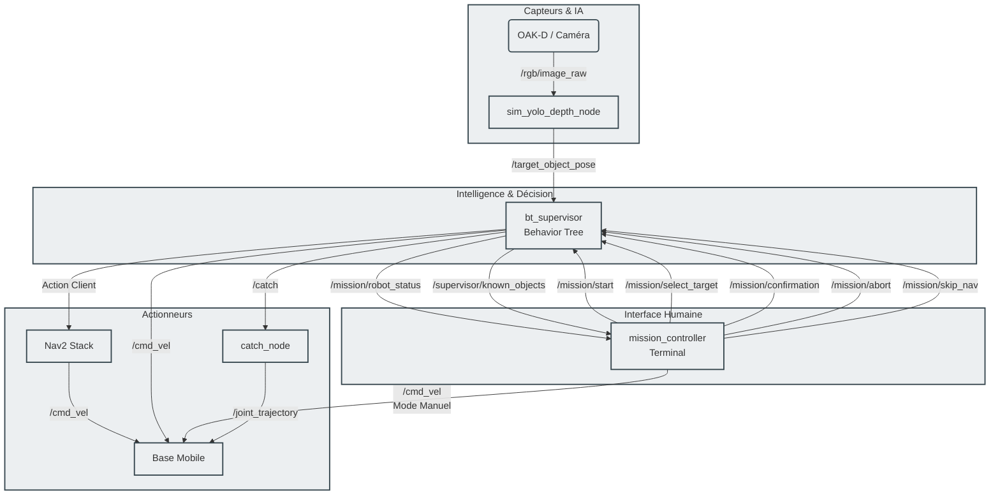
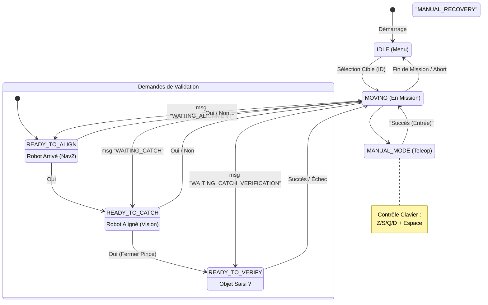

# Projet TurtleBot3 d'exploration, de recherhce IA et de récupération d'objet

Ce projet permet à un robot TurtleBot3 (Burger) équipé d'une pince robotique et d'une caméra OAK-D-PRO d'explorer une pièce inconnue de manière autonome (SLAM + Explore Lite) tout en analysant les objets rencontrés via la caméra (simulée pour gazebo) et un script de détection IA avec en plus la possibilité de ramasser des objets pour les ramener à la base.
Le projet combine :
- SLAM & Exploration (Nav2, SLAM Toolbox, Explore Lite)
- Vision par Ordinateur (YOLOv8 + Caméra OAK-D-PRO)
- Intelligence Décisionnelle (Behavior Trees avec py_trees)
- Human-in-the-loop (Validation humaine et récupération manuelle en cas d'échec via un controleur)

Ce projet a été réalisé dans le cadre des cours de _Systèmes intelligents autonomes_ et d'_Edge Computing et IA embarquée_ pour les étudiants de mineurs IOT CPS et d'IA du Master 2 informatique de Nice

## Fonctionnalités du projet
1. **Exploration Autonome :** Le robot cartographie l'environnement inconnu et détecte des objets d'intérêt (ex: cubes rouges).
2. **Détection 3D :** Localisation précise (X, Y, Z) des objets via YOLO et projection Depth-to-Map.
3. **Interface GUI de controle :** L'utilisateur reçoit la liste des objets trouvés et choisit une cible. Il peut également interrompre et "skip" les étapes
4. **Navigation Hybride :**
   * **Longue distance :** Utilise Nav2 pour se rendre proche de la cible.
   * **Courte distance :** Bascule sur une approche automatique(par cmd) basé sur la vision de la caméra pour l'approche finale vers l'objet cible(prototype en test).
5. **Manipulation :**
   * **Gestion de la pince (Simulée/Réelle)**.
   * **Mode "Recovery" Manuel :** Si l'approche échoue, l'utilisateur peut prendre le contrôle au clavier (pas-à-pas) pour ajuster la prise.


Remarque/hypothese de travail
objet à plus de 70 cm les un des autres dans l'environement (axe d'amélioration) 
faux positif possibles(axe d'amelioration sur le modele ia/algorythme de data association/ajout d'un comportement pour vérifier la présence réel des objets en ammonts)
les objets sont détectés que pendant la phase d'exploration, l'environeemnt reste fixe
approche et attrapage automatique à améliorer(taux d'erreur élevé)

## Prérequis Système

* **OS :** Ubuntu 22.04 LTS (Jammy Jellyfish)
* **Simulateur :** Gazebo Classic 11
* **ROS Version :** ROS 2 Humble Hawksbill

---

* ## Installation

### 1. Installer ROS 2 Humble
Si ROS 2 n'est pas encore installé, ouvrez un terminal et exécutez :

```bash
sudo apt update && sudo apt install software-properties-common curl -y
sudo add-apt-repository universe
sudo curl -sSL [https://raw.githubusercontent.com/ros/rosdistro/master/ros.key](https://raw.githubusercontent.com/ros/rosdistro/master/ros.key) -o /usr/share/keyrings/ros-archive-keyring.gpg
echo "deb [arch=$(dpkg --print-architecture) signed-by=/usr/share/keyrings/ros-archive-keyring.gpg] [http://packages.ros.org/ros2/ubuntu](http://packages.ros.org/ros2/ubuntu) $(. /etc/os-release && echo $UBUNTU_CODENAME) main" | sudo tee /etc/apt/sources.list.d/ros2.list > /dev/null
sudo apt update
sudo apt install ros-humble-desktop -y
sudo apt install python3-colcon-common-extensions -y
```

### 2. Installer les paquets du projet
```bash
sudo apt update
sudo apt install ros-humble-navigation2 ros-humble-nav2-bringup ros-humble-slam-toolbox -y
sudo apt install ros-humble-turtlebot3 ros-humble-turtlebot3-gazebo -y
sudo apt install python3-pip python3-opencv ros-humble-cv-bridge ros-humble-vision-opencv -y
sudo apt install ros-humble-stereo-image-proc -y
cd ~/ros2_ws/src
git clone https://github.com/robo-friends/m-explore-ros2.git
```

### 3. Configuration de l'environnement
```bash
echo 'source /opt/ros/humble/setup.bash' >> ~/.bashrc
echo 'export TURTLEBOT3_MODEL=waffle' >> ~/.bashrc
echo 'export LDS_MODEL=LDS-01' >> ~/.bashrc
# Fix pour l'affichage 3D dans les Machines Virtuelles
echo 'export LIBGL_ALWAYS_SOFTWARE=1' >> ~/.bashrc
# Rechargez le terminal
source ~/.bashrc
```
### 4. Clonage et Compilation
```bash
# Création du workspace
mkdir -p ~/ros2_ws/src
cd ~/ros2_ws/src

# Cloner le projet
git clone [https://github.com/NoeFBou/exploration_and_research_turtlebot.git](https://github.com/NoeFBou/exploration_and_research_turtlebot.git)

cd ~/ros2_ws
rosdep install --from-paths src --ignore-src -r -y

# Compiler
colcon build --symlink-install
source install/setup.bash
```

## Lancement

1er terminal pour lancer le launcher qui lance gazebo, Nav2, le nœud de Vision et le Superviseur (Behavior Tree)
```bash
cd ~/ros2_ws
source install/setup.bash
ros2 launch tb3_autonomy auto_explore.launch.py
```
*Attendez que "Nav2" soit prêt et que le message "Superviseur Prêt" apparaisse.*

2eme terminal pour activer l'interface GUI de controle(le 1er terminale peut etre envoyé en arriere, il ne sert plus sauf pour du debugage/dev)
```bash
cd ~/ros2_ws
source install/setup.bash
ros2 run tb3_autonomy mission_controller
```

## Dépannage TODO

Robot invisible
```bash
echo 'export GAZEBO_MODEL_PATH=$GAZEBO_MODEL_PATH:/opt/ros/humble/share/turtlebot3_gazebo/models' >> ~/.bashrc
source ~/.bashrc
```

# Workflow de la Simulation :


# Architecture de l'Arbre de Comportement (Mission_Supervisor)
L'arbre est conçu comme une Séquence Globale divisée en 4 phases distinctes(dont 2 executé en one shot).
## Description des Phases
1. Phase 0 : Initialisation
   * Safety Stop : Désactive l'exploration automatique(explorer lite) par default, l'exploration automatique se lance automatiquement, il faut danc la désactiver avec le topic : .
   * Init Ouvrir Pince : S'assure que la pince est ouverte et prête.
   * Attente GO : Le robot reste en attente tant que l'utilisateur n'a pas appuyé sur "Entrée" dans l'interface GUU du controleur.
2. Phase 1 : Exploration & Cartographie (OneShot)
   * Auto Explore ON : Active le nœud explore_lite.
   * En Parallel : 
     * Object Recorder : Enregistre en continu la position des objets (cubes rouges) détectés par l noeud IA. Applique algorithme de Data Association (pour éviter la saturation d'objets et le bruit de détection), basé sur la distance euclidienne. Les détections successives situées dans un rayon de 70cm sont fusionnées via une moyenne cumulative, ce qui permet de stabiliser la position estimée de l'objet au fil du temps. A noter qu'il y a quand un certain nombre de faux positif
     * Timer 100s : La phase dure 100 secondes. Une fois le temps écoulé, le Parallel réussit et on passe à la suite. Mesure de sécurité pour empecher que l'exploration dure indefiniment en cas de blocage des "goal" nav2 du turtle et pour la présentation de la simulation. A ajuster(le temps par exemple) ou supprimer selon les besoins. 
     * La phase est executé une seule fois et les objets seront détectés uniquement dans cette phase. 
4. Phase 2 : Sélection de la Cible
   * Stop Explore : Arrête le robot et coupe l'exploration autonome.
   * Menu Console : Le robot attend que l'utilisateur sélectionne un ID d'objet via le terminal de controle. Il récupère les coordonnées de la cible choisie.
5. Phase 3 : Récupération (Fetch)
   
      cette branche est divisée en trois sous-étapes :
   1. Approche Longue Distance (Nav2) : 
      * Le robot utilise la stack de navigation ROS 2 pour se rendre près de l'objet.
      * Interruption (Skip) : Cette action est placée dans un nœud Parallel. Si l'utilisateur appuie sur "S" (Skip), la navigation est annulée et l'arbre passe à l'étape suivante. Utile on s'est trompé ou qu'on souhaite changer de cible ou si le robot est bloqué.
   2. Boucle de Tentative d'attrapage/de catch de l'objet (Retry Loop) :
      * Demande Alignement : Le robot attend votre confirmation que c'est le bon objet à attraper pour commencer une maneuvre d'alignement.
      * Rotation "Visuelle" : S'aligne face à l'objet(mathématiquement).
      * Avance : Avance en boucle ouverte jusqu'à être à 10cm de l'objet.
        * Sélecteur de Décision (Auto vs Manuel) :
          * Branche AUTO : Tente de fermer la pince. Si l'utilisateur confirme le succès, le robot rentre à la base.
          * Branche MANUEL : Si l'auto échoue (ou refus utilisateur), on passe en pilotage clavier. Une fois l'objet attrapé manuellement, le robot rentre à la base.
            Fin de Mission
   3. Signal IDLE : Une fois la mission terminée (ou abandonnée via Abort), ce nœud envoie le signal "IDLE" pour réinitialiser le menu du contrôleur.

## Diagramme Visuel de l'arbre de comportement


```mermaid
graph TD
    %% Noeuds principaux
    Root(" Mission Supervisor<br/>(Sequence)")
    
    %% PHASE 0: INIT
    P0("Phase 0: Initialisation<br/>[OneShot]")
    P0_Seq("Séquence Init")
    Stop1[Safety Stop]
    Open1[Ouvrir Pince]
    WaitStart[Attente Signal 'GO']

    %% PHASE 1: EXPLORE
    P1("Phase 1: Exploration<br/>[OneShot]")
    P1_Seq("Séquence Explore")
    AutoExp[Auto Explore ON]
    ScanPar(" Scanning...<br/>(Parallel)")
    Recorder[Object Recorder]
    Timer[Timer 100s]

    %% PHASE 2: SELECT
    P2("Phase 2: Sélection<br/>(Sequence)")
    StopExp[Stop Explore]
    WaitSelect[Attente Choix Utilisateur]

    %% PHASE 3: FETCH
    P3("Phase 3: Récupération<br/>(Sequence)")
    
    %% Sous-partie Navigation
    NavPar(" Approche ou Skip<br/>(Parallel)")
    NavSeq("Nav2 Sequence")
    GoTo[GoTo Detected Target]
    SkipBtn[Bouton SKIP]

    %% Sous-partie Loop / Abort
    LoopAbort(" Boucle ou Abort<br/>(Parallel)")
    AbortBtn[Bouton ABORT]
    RetryDec(" Retry Loop<br/>[Decorator]")
    AttemptSeq("Tentative Catch<br/>(Sequence)")
    
    %% Actions fines
    AskAlign{Demande<br/>Alignement?}
    Rotate[Rotation Visuelle]
    Advance[Avance Fine]
    
    %% Sélecteur Auto/Manuel
    Selector(" Auto ou Manuel<br/>(Selector)")
    
    %% Branche Auto
    SeqAuto("Branche AUTO<br/>(Sequence)")
    AskCatch{Confirmer<br/>Catch?}
    ActionCatch[Fermer Pince]
    CheckCatch{Vérifier<br/>Prise?}
    HomeAuto(" Retour Base<br/>(Auto)")

    %% Branche Manuel
    SeqMan("Branche MANUEL<br/>(Sequence)")
    ManRec[ Pilotage Manuel]
    HomeMan(" Retour Base<br/>(Manuel)")

    %% Signal Fin
    Idle[Signal IDLE]

    %% LIENS
    Root --> P0
    Root --> P1
    Root --> P2
    Root --> P3

    %% Phase 0
    P0 --> P0_Seq
    P0_Seq --> Stop1 --> Open1 --> WaitStart

    %% Phase 1
    P1 --> P1_Seq
    P1_Seq --> AutoExp --> ScanPar
    ScanPar --> Recorder
    ScanPar --> Timer

    %% Phase 2
    P2 --> StopExp --> WaitSelect

    %% Phase 3
    P3 --> NavPar --> LoopAbort --> Idle
    
    NavPar --> NavSeq --> GoTo
    NavPar --> SkipBtn

    LoopAbort --> RetryDec --> AttemptSeq
    LoopAbort --> AbortBtn

    AttemptSeq --> AskAlign --> Rotate --> Advance --> Selector

    Selector --> SeqAuto
    Selector --> SeqMan

    SeqAuto --> AskCatch --> ActionCatch --> CheckCatch --> HomeAuto
    SeqMan --> ManRec --> HomeMan

    %% Styles
    classDef seq fill:#e1f5fe,stroke:#01579b,stroke-width:2px;
    classDef par fill:#fff3e0,stroke:#e65100,stroke-width:2px;
    classDef sel fill:#e8f5e9,stroke:#1b5e20,stroke-width:2px;
    classDef act fill:#f3e5f5,stroke:#4a148c,stroke-width:1px;
    
    class Root,P0_Seq,P1_Seq,P2,P3,NavSeq,AttemptSeq,SeqAuto,SeqMan seq;
    class ScanPar,NavPar,LoopAbort par;
    class Selector sel;
    class Stop1,Open1,WaitStart,AutoExp,Recorder,Timer,StopExp,WaitSelect,GoTo,SkipBtn,AbortBtn,AskAlign,Rotate,Advance,AskCatch,ActionCatch,CheckCatch,ManRec,HomeAuto,HomeMan,Idle act;
```

# Architecture des Topics ROS 2 (data flow)
Schéma montre comment l'information circule entre vos nœuds : de la caméra jusqu'aux moteurs, en passant par le Supervisor et le Controller.


```mermaid
graph TD
    %% Noeuds ROS 2
    subgraph SENSORS [Capteurs & IA]
        Cam(OAK-D / Caméra)
        YOLO[sim_yolo_depth_node]
    end

    subgraph BRAIN [Intelligence & Décision]
        BT[bt_supervisor<br/>Behavior Tree]
    end

    subgraph UI [Interface Humaine]
        CTRL[mission_controller<br/>Terminal]
    end

    subgraph ACTUATORS [Actionneurs]
        Nav2[Nav2 Stack]
        Catch[catch_node]
        Base[Base Mobile]
    end

    %% Flux de données (Topics)
    Cam -->|/rgb/image_raw| YOLO
    YOLO -->|/target_object_pose| BT
    
    %% Communication Supervisor <-> Controller
    BT -->|/mission/robot_status| CTRL
    BT -->|/supervisor/known_objects| CTRL
    
    CTRL -->|/mission/start| BT
    CTRL -->|/mission/select_target| BT
    CTRL -->|/mission/confirmation| BT
    CTRL -->|/mission/abort| BT
    CTRL -->|/mission/skip_nav| BT

    %% Actions du Cerveau
    BT -->|Action Client| Nav2
    BT -->|/catch| Catch
    
    %% Commandes Moteurs (Priorités)
    Nav2 -->|/cmd_vel| Base
    BT -->|/cmd_vel| Base
    CTRL -->|/cmd_vel<br/>Mode Manuel| Base
    Catch -->|/joint_trajectory| Base

    %% Styles
    classDef node fill:#eceff1,stroke:#37474f,stroke-width:2px;
    classDef topic stroke-dasharray: 5 5;
    class SENSORS,BRAIN,UI,ACTUATORS node;
```

# Machine à États du Contrôleur
Description du fonctionnment de l'interface GUI de controle et comment il réafit aux messages des comportements/noeuds.


```mermaid
stateDiagram-v2
    [*] --> IDLE: Démarrage

    state "IDLE (Menu)" as IDLE
    state "MOVING (En Mission)" as MOVING
    state "MANUAL_MODE (Teleop)" as MANUAL

    %% Transitions principales
    IDLE --> MOVING: Sélection Cible (ID)
    MOVING --> IDLE: Fin de Mission / Abort

    %% Interactions Robot -> Humain
    state "Demandes de Validation" as ASK {
        state "READY_TO_ALIGN" as ALIGN
        state "READY_TO_CATCH" as CATCH
        state "READY_TO_VERIFY" as VERIF

        ALIGN: Robot Arrivé (Nav2)
        CATCH: Robot Aligné (Vision)
        VERIF: Objet Saisi ?

        [*] --> ALIGN
        ALIGN --> CATCH: Oui
        CATCH --> VERIF: Oui (Fermer Pince)
    }

    %% Liens événements
    MOVING --> ALIGN: msg "WAITING_ALIGNMENT"
    MOVING --> CATCH: msg "WAITING_CATCH"
    MOVING --> VERIF: msg "WAITING_CATCH_VERIFICATION"

    %% Réponses Humaines
    ALIGN --> MOVING: Oui / Non
    CATCH --> MOVING: Oui / Non
    VERIF --> MOVING: Succès / Échec

    %% Mode Manuel (Recovery)
    MOVING --> MANUAL msg: "MANUAL_RECOVERY"
    MANUAL --> MOVING: "Succès (Entrée)"

    %% Notes
    note right of MANUAL
        Contrôle Clavier :
        Z/S/Q/D + Espace
    end note
```

## Auteurs & Licence
Projet réalisé par **Nono**.
Licence : Apache 2.0 / MIT (À définir).
