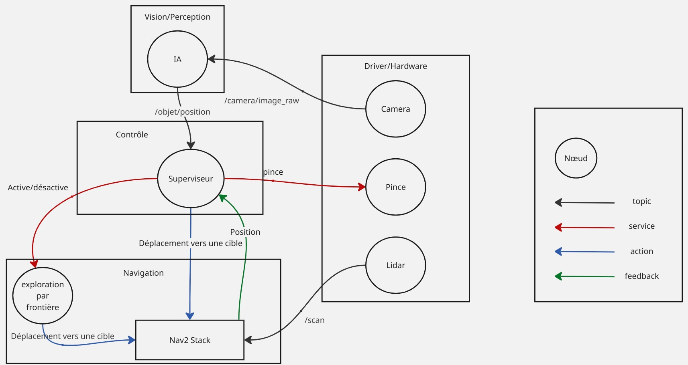
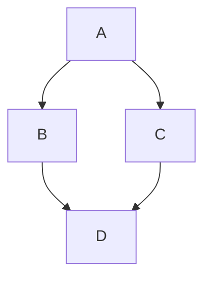

# Projet TurtleBot3 d'exploration, de recherhce IA et de récupération d'objet

Ce projet permet à un robot TurtleBot3 (Burger) équipé d'une pince robotique et d'une caméra OAK-D-PRO d'explorer une pièce inconnue de manière autonome (SLAM + Explore Lite) tout en analysant les objets rencontrés via la caméra (simulée pour gazebo) et un script de détection IA avec en plus la possibilité de ramasser des objets pour les ramener à la base.
Le projet combine :
- SLAM & Exploration (Nav2, SLAM Toolbox, Explore Lite)
- Vision par Ordinateur (YOLOv8 + Caméra OAK-D-PRO)
- Intelligence Décisionnelle (Behavior Trees avec py_trees)
- Human-in-the-loop (Validation humaine et récupération manuelle en cas d'échec via un controleur)

Ce projet a été réalisé dans le cadre des cours de _Systèmes intelligents autonomes_ et d'_Edge Computing et IA embarquée_ pour les étudiants de mineurs IOT CPS et d'IA du Master 2 informatique de Nice

## Fonctionnalités du projet
1. **Exploration Autonome :** Le robot cartographie l'environnement inconnu et détecte des objets d'intérêt (ex: cubes rouges).
2. **Détection 3D :** Localisation précise (X, Y, Z) des objets via YOLO et projection Depth-to-Map.
3. **Interface GUI de controle :** L'utilisateur reçoit la liste des objets trouvés et choisit une cible. Il peut également interrompre et "skip" les étapes
4. **Navigation Hybride :**
   * **Longue distance :** Utilise Nav2 pour se rendre proche de la cible.
   * **Courte distance :** Bascule sur une approche automatique(par cmd) basé sur la vision de la caméra pour l'approche finale vers l'objet cible(prototype en test).
5. **Manipulation :**
   * **Gestion de la pince (Simulée/Réelle)**.
   * **Mode "Recovery" Manuel :** Si l'approche échoue, l'utilisateur peut prendre le contrôle au clavier (pas-à-pas) pour ajuster la prise.


## archi WIP 



## Prérequis Système

* **OS :** Ubuntu 22.04 LTS (Jammy Jellyfish)
* **Simulateur :** Gazebo Classic 11
* **ROS Version :** ROS 2 Humble Hawksbill

---

* ## Installation

### 1. Installer ROS 2 Humble
Si ROS 2 n'est pas encore installé, ouvrez un terminal et exécutez :

```bash
sudo apt update && sudo apt install software-properties-common curl -y
sudo add-apt-repository universe
sudo curl -sSL [https://raw.githubusercontent.com/ros/rosdistro/master/ros.key](https://raw.githubusercontent.com/ros/rosdistro/master/ros.key) -o /usr/share/keyrings/ros-archive-keyring.gpg
echo "deb [arch=$(dpkg --print-architecture) signed-by=/usr/share/keyrings/ros-archive-keyring.gpg] [http://packages.ros.org/ros2/ubuntu](http://packages.ros.org/ros2/ubuntu) $(. /etc/os-release && echo $UBUNTU_CODENAME) main" | sudo tee /etc/apt/sources.list.d/ros2.list > /dev/null
sudo apt update
sudo apt install ros-humble-desktop -y
sudo apt install python3-colcon-common-extensions -y
```

### 2. Installer les paquets du projet
```bash
sudo apt update
sudo apt install ros-humble-navigation2 ros-humble-nav2-bringup ros-humble-slam-toolbox -y
sudo apt install ros-humble-turtlebot3 ros-humble-turtlebot3-gazebo -y
sudo apt install python3-pip python3-opencv ros-humble-cv-bridge ros-humble-vision-opencv -y
sudo apt install ros-humble-stereo-image-proc -y
cd ~/ros2_ws/src
git clone https://github.com/robo-friends/m-explore-ros2.git
```

### 3. Configuration de l'environnement
```bash
echo 'source /opt/ros/humble/setup.bash' >> ~/.bashrc
echo 'export TURTLEBOT3_MODEL=waffle' >> ~/.bashrc
echo 'export LDS_MODEL=LDS-01' >> ~/.bashrc
# Fix pour l'affichage 3D dans les Machines Virtuelles
echo 'export LIBGL_ALWAYS_SOFTWARE=1' >> ~/.bashrc
# Rechargez le terminal
source ~/.bashrc
```
### 4. Clonage et Compilation
```bash
# Création du workspace
mkdir -p ~/ros2_ws/src
cd ~/ros2_ws/src

# Cloner le projet
git clone [https://github.com/NoeFBou/exploration_and_research_turtlebot.git](https://github.com/NoeFBou/exploration_and_research_turtlebot.git)

cd ~/ros2_ws
rosdep install --from-paths src --ignore-src -r -y

# Compiler
colcon build --symlink-install
source install/setup.bash
```

## Lancement

1er terminal pour lancer le launcher qui lance gazebo, Nav2, le nœud de Vision et le Superviseur (Behavior Tree)
```bash
cd ~/ros2_ws
source install/setup.bash
ros2 launch tb3_autonomy auto_explore.launch.py
```
*Attendez que "Nav2" soit prêt et que le message "Superviseur Prêt" apparaisse.*

2eme terminal pour activer l'interface GUI de controle(le 1er terminale peut etre envoyé en arriere, il ne sert plus sauf pour du debugage/dev)
```bash
cd ~/ros2_ws
source install/setup.bash
ros2 run tb3_autonomy mission_controller
```

## Dépannage TODO

Robot invisible
```bash
echo 'export GAZEBO_MODEL_PATH=$GAZEBO_MODEL_PATH:/opt/ros/humble/share/turtlebot3_gazebo/models' >> ~/.bashrc
source ~/.bashrc
```

# Workflow de la Simulation :

```mermaid
graph TD;
    A-->B;
    A-->C;
    B-->D;
    C-->D;
```

## Auteurs & Licence
Projet réalisé par **Nono**.
Licence : Apache 2.0 / MIT (À définir).
